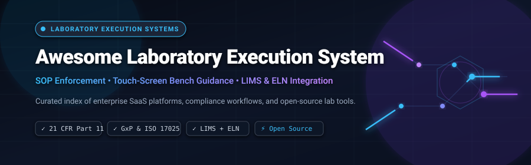

<p align="center">
  
</p>

<p align="center">
  <a href="https://github.com/ishandutta2007/Awesome-Awesome-Awesome"></a><a href="https://discord.gg/jc4xtF58Ve"></a>
  <a href="https://github.com/ishandutta2007/Awesome-Laboratory-Execution-System/stargazers"></a>
  <a href="https://github.com/ishandutta2007/Awesome-Laboratory-Execution-System/network/members"></a>
  <a href="https://github.com/ishandutta2007/Awesome-Laboratory-Execution-System/blob/main/LICENSE"></a>
  <a href="https://github.com/ishandutta2007/Awesome-Laboratory-Execution-System/pulls"></a>
  <a href="https://github.com/ishandutta2007"></a>
</p>

---

# 🧪 Awesome Laboratory Execution System (LES)

### 🔬 Curated Guide to Enterprise LES Platforms, LIMS/ELN Suites & Open-Source Lab Automation
*Focused on SOP-Driven Procedure Execution, Benchtop Workflows, Sample Tracking, Touch-Screen Guidance, 21 CFR Part 11 Compliance & GxP/ISO 17025 Integration.*

---

## 📖 Overview & SEO Guide to Laboratory Execution Systems

A **Laboratory Execution System (LES)** is a specialized, procedure-centric software layer designed to guide analysts and scientists step-by-step through laboratory Standard Operating Procedures (SOPs), analytical test methods, and sample preparation protocols at the bench. While traditional systems log what was tested after the fact, an LES actively enforces **how** tests are executed in real time.

```
       ┌─────────────────────────────────────────────────────────────┐
       │             Enterprise Scientific Architecture              │
       └──────────────────────────────┬──────────────────────────────┘
                                      │
              ┌───────────────────────┼───────────────────────┐
              ▼                       ▼                       ▼
      ┌───────────────┐       ┌───────────────┐       ┌───────────────┐
      │   LIMS (Sample)│      │  LES (Method) │       │  ELN (Experiment)
      │ • Tracking    │◄─────►│ • Step-by-Step│◄─────►│ • R&D Protocol│
      │ • Batches/COA │       │ • Bench SOP   │       │ • Unstructured│
      │ • Chain of C. │       │ • Data Capture│       │ • IP Capture  │
      └───────────────┘       └───────┬───────┘       └───────────────┘
                                      │
                     ┌────────────────┴────────────────┐
                     ▼                                 ▼
             ┌───────────────┐                 ┌───────────────┐
             │ RS232/USB/IoT │                 │ Barcode & Touch│
             │  Instruments  │                 │ Bench Tablets │
             └───────────────┘                 └───────────────┘
```

### 🔍 LES vs. LIMS vs. ELN: Key Differences
* **Laboratory Execution System (LES):** **Procedure-centric.** Guides the technician through precise step-by-step test execution, validates equipment calibration/reagents before each step, enforces strict SOP compliance, logs real-time weights and measures directly from instruments, and creates defensible electronic batch records (eBR).
* **Laboratory Information Management System (LIMS):** **Sample-centric.** Manages sample receipt, chain of custody, batch allocation, testing queues, specification checks, and Certificate of Analysis (COA) generation.
* **Electronic Lab Notebook (ELN):** **Experiment-centric.** Primarily serves exploratory R&D and discovery environments with semi-structured and freeform notes, chemical sketchers, biological sequence registries, and patent-defense intellectual property records.

---

## 📑 Table of Contents
- [☁️ SaaS & Hosted Platforms](#️-saas--hosted-platforms)
- [💻 Open-Source GitHub Projects](#-open-source-github-projects)
- [🧩 Functional Pillars of a Modern LES](#-functional-pillars-of-a-modern-les)
- [🤝 How to Contribute](#-how-to-contribute)
- [📈 Star History](#-star-history)
- [💖 Support & Community](#-support--community)
- [📜 Disclaimer](#-disclaimer)

---

## ☁️ SaaS & Hosted Platforms

> 📊 **Market Overview & Industry Structure:** The global Laboratory Execution System (LES) and laboratory informatics market is valued at approximately **USD $5.15 billion** and is projected to expand beyond **USD $10 billion by 2030–2035** (CAGR: ~5.3%–9.9%). The sector is **moderately to highly fragmented** rather than a winner-take-all market. Enterprise QA/QC manufacturing and regulated pharmaceutical production are led by established conglomerates (Thermo Fisher Scientific, Dassault Systèmes, Agilent Technologies, LabWare), while life sciences R&D, biobanks, and specialty diagnostic laboratories rely on agile, modern cloud-native SaaS platforms (Benchling, CloudLIMS, Labii).

The table below catalogs premier commercial and SaaS LES solutions, ranked in descending order by company scale (market capitalization, enterprise valuation, or annual revenue):

| 🏢 Platform / Vendor | 📊 Company Scale (Revenue / Valuation) | 🎯 Core Capabilities & Architecture | 💳 Starting Tier Pricing | 🎁 Free Tier / Trial Limits |
| :--- | :--- | :--- | :--- | :--- |
| **[Thermo Fisher SampleManager](https://www.thermofisher.com/)** | **~$210 Billion Market Cap**<br>*(~$42.9B Annual Revenue, NYSE: TMO)* | Enterprise-grade LIMS, LES, and SDMS suite. Provides automated instrument parsing, barcode-driven bench workflows, and strict 21 CFR Part 11 / ISO 17025 compliance. | **~$150 – $250 / user / month**<br>*(Entry deployment packages start from ~$35,000 / year)* | **30-day proof-of-concept sandbox trial** upon sales consultation with pre-configured method templates *(no permanent free plan)*. |
| **[Biovia ONE Lab](https://www.3ds.com/)** *(Dassault Systèmes)* | **~$45 Billion Market Cap**<br>*(€5.95B / ~$6.4B Revenue, Euronext: DSY)* | Powered by Dassault's 3DEXPERIENCE platform. Features procedure execution, recipe design, sample preparation guidance, and seamless integration between R&D and QA/QC. | **~$300 – $500 / user / month**<br>*(Entry commercial tier starts from ~$25,000 / year)* | **14-to-30-day guided pilot sandbox** configured for target analytical workflows upon request *(no permanent free plan)*. |
| **[Agilent SLIMS](https://www.agilent.com/)** | **~$38 Billion Market Cap**<br>*(~$6.83B Annual Revenue, NYSE: A)* | Combines LIMS, ELN, and LES into a unified laboratory environment. Excels in analytical testing labs, NGS pipelines, chromatography data integration, and sample prep. | **~$200 – $300 / user / month**<br>*(Starting annual packages begin from ~$20,000 / year)* | **30-day guided evaluation sandbox** provisioned post-demo for validation assessment *(no permanent free plan)*. |
| **[Benchling](https://www.benchling.com/)** | **$6.1 Billion Valuation**<br>*(Series F Unicorn, ~$200M+ ARR)* | Cloud-native R&D ecosystem uniting ELN, sample registries, inventory, and guided workflow execution. Widely recognized in biotechnology, CRISPR, and molecular biology. | **~$1,250 / month base**<br>*(Startup package starts at ~$15,000 / year, ~$250 / user / mo)* | **Permanent Free Academic Plan** (unlimited users, 10 GB storage, full ELN & Molecular Biology suite; excludes commercial Workflows) & **14-day commercial trial**. |
| **[LabWare LES](https://www.labware.com/)** | **~$2.5 Billion Valuation**<br>*(~$250M – $300M Annual Revenue)* | Global market leader in enterprise QA/QC laboratories. Enforces step-by-step electronic test procedures, real-time balance integration, and automated deviation management. | **~$300 / user / month**<br>*(LabWare GROW / SaaS entry plans start from ~$3,600 / user / year or $25k base)* | **30-day pilot evaluation sandbox** provided during enterprise solution scoping *(no permanent free plan)*. |
| **[STARLIMS LES](https://www.starlims.com/)** | **~$500 Million Valuation**<br>*(Francisco Partners, ~$120M – $150M ARR)* | Dedicated tablet and touch-screen bench execution engine. Guides analysts through SOPs, enforces instrument calibration checks, and provides end-to-end data integrity. | **~$250 / user / month**<br>*(Entry subscription packages begin at ~$25,000 / year)* | **30-day proof-of-concept trial** provisioned with sample laboratory testing methods *(no permanent free plan)*. |
| **[LabVantage LES](https://www.labvantage.com/)** | **~$400 Million Valuation**<br>*(TCG Lifesciences, ~$100M – $120M ARR)* | 100% browser-based execution module integrated with LabVantage LIMS. Replaces paper bench worksheets with dynamic electronic execution sheets and barcode scanning. | **~$250 / user / month**<br>*(Entry deployment contracts start at ~$30,000 / year)* | **14-to-30-day custom demonstration sandbox** configured for customer SOP testing *(no permanent free plan)*. |
| **[CloudLIMS](https://cloudlims.com/)** | **~$35M – $50M Valuation**<br>*(~$8M – $12M Annual Revenue)* | Secure SaaS LIMS with integrated procedure checklists and audit trails. Engineered for clinical testing, biobanking, food & beverage, and third-party analytical laboratories. | **$230 / user / month**<br>*(Billed annually; minimum 3 users = starting at $690 / month)* | **30-day customized evaluation sandbox** configured on demand with laboratory-specific workflows *(no permanent free plan)*. |
| **[LabCollector](https://labcollector.com/)** *(AgileBio)* | **~$25M – $35M Valuation**<br>*(~$5M – $8M Annual Revenue)* | Modular web-based lab intranet system featuring dedicated workflow execution worksheets, inventory management, equipment scheduling, and ELN add-ons. | **€300 / user / year**<br>*(~$27.50 / user / month; min 3 users = €900 / yr; LIMS pack ~$550 / user / yr)* | **Permanent Free "Startup Pack"** (up to 3 users and 1,000 records on self-hosted instances) & **30-day full cloud trial**. |
| **[Labii](https://www.labii.com/)** | **~$10M – $15M Valuation**<br>*(~$1.5M – $3M Annual Revenue)* | Highly configurable ELN and LIMS platform utilizing customizable widgets, interactive SOP cards, and protocol steps for bench researchers and bio-startups. | **$479 / user / year**<br>*(~$39.92 / user / month billed annually for Professional; Pay-Per-Use from $10/mo)* | **Permanent Free Plan** (1 user, 1 active project, 1 record created per day) & **14-day full-access trial** (unlimited tables and records). |

---

## 💻 Open-Source GitHub Projects

Open-source solutions are vital for academic cores, biofoundries, clinical research teams, and cost-conscious laboratories. These projects provide auditable codebases for procedure execution, protocol automation, sample tracking, and digital laboratory notebooks.

The list below is sorted in **descending order by GitHub Stars_Count**:

1. **[eLabFTW](https://github.com/elabftw/elabftw)** [](https://github.com/elabftw/elabftw/stargazers)  
   The gold standard open-source electronic lab notebook (ELN) and experiment execution tracker. Features 21 CFR Part 11 compliant digital signatures, timestamping, inventory management, custom metadata forms, and a complete REST API.

2. **[Opentrons](https://github.com/Opentrons/opentrons)** [](https://github.com/Opentrons/opentrons/stargazers)  
   Open-source automated execution platform for liquid handling robots (OT-2 & Flex). Translates computational protocol scripts into physical bench execution steps with pipette calibration and deck verification.

3. **[SENAITE Core](https://github.com/senaite/senaite.core)** [](https://github.com/senaite/senaite.core/stargazers)  
   Enterprise-grade open-source LIMS and workflow engine built on Python and Plone. Includes ISO 17025 compliant worksheets, sample batch management, multi-step review workflows, and two-way instrument connectors.

4. **[LaminDB](https://github.com/laminlabs/lamindb)** [](https://github.com/laminlabs/lamindb/stargazers)  
   Open-source biological data and sample registry management platform. Provides lineage-native tracking from wet-lab execution steps to downstream computational biology models and AI pipelines.

5. **[MISO LIMS](https://github.com/miso-lims/miso-lims)** [](https://github.com/miso-lims/miso-lims/stargazers)  
   Open-source laboratory information and execution tracking system specifically tailored for high-throughput Next-Generation Sequencing (NGS) centers, tracking library prep, pooling, flow cells, and runs.

6. **[OpenELIS Global 2](https://github.com/DIGI-UW/OpenELIS-Global-2)** [](https://github.com/DIGI-UW/OpenELIS-Global-2/stargazers)  
   Enterprise open-source laboratory information and execution system deployed in public health and reference laboratories across 25+ countries. Built on Java/Spring and React with native FHIR R4 interoperability.

7. **[Bika LIMS](https://github.com/bikalabs/bika.lims)** [](https://github.com/bikalabs/bika.lims/stargazers)  
   The pioneer open-source web LIMS codebase that laid the technical groundwork for modern open lab management, offering sample partitions, worksheets, instrument interfaces, and verification chains.

8. **[NEMO](https://github.com/usnistgov/NEMO)** [](https://github.com/usnistgov/NEMO/stargazers)  
   Laboratory logistics and hardware access execution platform developed by the National Institute of Standards and Technology (NIST) for instrument reservation, technician qualification enforcement, and maintenance tracking.

9. **[Autoprotocol Python](https://github.com/autoprotocol/autoprotocol-python)** [](https://github.com/autoprotocol/autoprotocol-python/stargazers)  
   Standard Python library for Autoprotocol—the open specification for formalizing experiments and laboratory execution instructions into deterministic, machine-readable instructions.

10. **[iSkyLIMS](https://github.com/BU-ISCIII/iskylims)** [](https://github.com/BU-ISCIII/iskylims/stargazers)  
    Django-based open-source LIMS and workflow coordinator developed by bioinformatics units to manage NGS sequencing runs, tracking sample steps from receipt to final reporting.

11. **[Baobab LIMS](https://github.com/BaobabLims/baobab.lims)** [](https://github.com/BaobabLims/baobab.lims/stargazers)  
    Specialized open-source biospecimen lifecycle management system for biobanks, enforcing cold-chain tracking, SOP-guided aliquot processing, and donor consent documentation.

12. **[Aquarium](https://github.com/aquariumbio/aquarium)** [](https://github.com/aquariumbio/aquarium/stargazers)  
    A full-fledged Lab Operating System (LOS) developed at the University of Washington for biofoundries. Provides interactive touch-screen bench guidance that leads technicians step-by-step through synthetic biology protocols.

13. **[Open-LIMS](https://github.com/open-lims/open-lims)** [](https://github.com/open-lims/open-lims/stargazers)  
    Modular, web-based open-source system designed for academic and commercial labs to organize samples, test requests, project documents, and execution histories.

14. **[LabKey Platform](https://github.com/LabKey/platform)** [](https://github.com/LabKey/platform/stargazers)  
    The open-source core behind LabKey Server, providing structured assay data capture, specimen tracking, longitudinal study coordination, and automated ETL pipelines.

---

## 🧩 Functional Pillars of a Modern LES

When evaluating or designing a Laboratory Execution System, ensure it supports these six core architectural pillars:

```
┌───────────────────────────────────────────────────────────────────────────┐
│                    6 Core Functional Pillars of LES                       │
├───────────────────┬───────────────────┬───────────────────────────────────┤
│ 1. SOP Enforcement│ 2. Direct Capture │ 3. Barcode Verification           │
│ • Step gating     │ • RS232 / USB / IP│ • Sample tube verification        │
│ • In-line formulas│ • Analytical scale│ • Reagent lot & expiry checks     │
│ • Limits & alerts │ • pH / Titrators  │ • Instrument ID scan              │
├───────────────────┼───────────────────┼───────────────────────────────────┤
│ 4. Touch Guidance │ 5. Full Compliance│ 6. LIMS/ELN Interoperability      │
│ • Large UI buttons│ • 21 CFR Part 11  │ • Bi-directional REST/GraphQL     │
│ • Glove-friendly  │ • Dual e-signature│ • FHIR / AnIML / SiLA 2 standards │
│ • Voice / Foot-ped│ • Audit trails    │ • Automated COA pushing           │
└───────────────────┴───────────────────┴───────────────────────────────────┘
```

1. **⚡ Dynamic SOP & Recipe Enforcement:** Strict step gating that prevents technicians from proceeding to subsequent steps until previous parameters meet acceptance criteria.
2. **⚖️ Direct Instrument Data Capture:** Real-time acquisition of readings from analytical balances, pH meters, moisture analyzers, and titrators via RS232, USB, or IoT interfaces to eliminate manual transcription errors.
3. **🏷️ Reagent & Consumable Verification:** Scans barcode lots to confirm reagents have not expired, have been properly stored, and match the specified method requirements.
4. **📱 Touch-Screen & Glove-Friendly Bench Interface:** Clear visual cues, high-contrast layouts, and touch-optimized buttons suitable for tablets mounted directly at biosafety cabinets or laminar flow hoods.
5. **🛡️ Defensible Regulatory Compliance:** Native adherence to **FDA 21 CFR Part 11**, **EU Annex 11**, and **ISO 17025/15189**, featuring time-stamped audit trails and dual-witness electronic signatures.
6. **🔄 Bi-Directional Integration:** Seamless data exchange with upstream LIMS (for worklists and sample metadata) and downstream ELNs/ERPs (for final release, reporting, and archiving).

---

## 🤝 How to Contribute

Contributions from the laboratory informatics community are warmly welcome!

1. 🍴 **Fork the Repository** on GitHub.
2. 🌿 **Create a Feature Branch:** `git checkout -b feature/add-new-platform`.
3. 📝 **Add or Update Information:** Ensure SaaS entries follow the tabular structure with verified starting tier pricing, free trial limits, and company scale. For open-source tools, include the Shields Stars_Badge linked to the stargazers page.
4. 🔎 **Verify Links & Neutrality:** Maintain objective, factual descriptions and verify that official links resolve correctly.
5. 🚀 **Submit a Pull Request** with a concise description of your additions.

For other awesome curated lists, check out **[Awesome-Awesome-Awesome](https://github.com/ishandutta2007/Awesome-Awesome-Awesome)**.

---

## 📈 Star History

[](https://star-history.dera.page/#ishandutta2007/Awesome-Laboratory-Execution-System&type=date&legend=top-left)

---

## 💖 Support & Community

Thank you for visiting and supporting the **Awesome Laboratory Execution System** ecosystem! Maintaining a curated, up-to-date, and high-quality index of scientific software takes dedicated research and continuous effort.

If you find this repository valuable for your research, company, or laboratory operations, please consider showing your support:
* ⭐ **Star this repository** on GitHub to help other scientists, informaticians, and QA managers discover it.
* 🍴 **Fork and contribute** new platforms, open-source utilities, or updated workflow capabilities.
* 📢 **Share this guide** across your professional networks, LinkedIn, Slack, and lab tech forums.
* ☕ **Sponsor the Project:** You can support the ongoing maintenance and development of this and other open science initiatives via the **[GitHub Sponsors Dashboard](https://github.com/sponsors/ishandutta2007)**.

<p align="center">
  <a href="https://github.com/sponsors/ishandutta2007">
    
  </a>
</p>

---

## 📜 Disclaimer

* This repository is an independently maintained, **community-curated index** created solely for informational, architectural, and educational purposes. Inclusion does not constitute an endorsement or warranty.
* Laboratory execution in regulated environments (e.g., cGMP, GLP, ISO 17025, ISO 15189, CLIA, CAP) requires formal Computer System Validation (CSV), qualification (IQ/OQ/PQ), and rigorous quality oversight.
* Product names, logos, and trademarks belong to their respective corporate owners.
